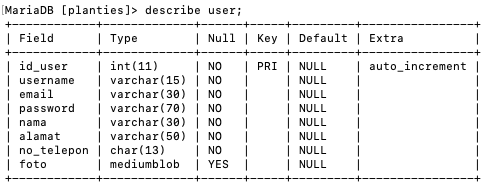

Planties
> Here goes your awesome project description!

## Table of contents
* [General info](#general-info)
* [Technologies](#technologies)
* [Setup](#setup)
* [Module](#module)
* [Implementasi Basis Data](#data)

## General info
Planties adalah desktop application untuk jual-beli tanaman yang diprogram dengan Python, didesain dengan Qt, dan memanfaatkan MySQL sebagai database system. Perangkat lunak ini memiliki fitur login, registrasi, menampilkan dan mencari katalog produk, melihat detail suatu produk dan testimoni/rating, penambahan barang yang akan dibeli ke keranjang, menampilkan form pembayaran, melihat riwayat transaksi, serta menambah rating.

## Technologies
* Python - version 3.9.1
* MariaDB - version 15.1

## Setup
Libraries
* Download repository.
* Pastikan library MySQL dan PyQt 5 sudah di-install, jika belum:
`pip install mysql-connector-python`
`pip install PyQt5`

Database configuration
* Jalankan MariaDB.
* Import planties.sql sebagai database lokal bernama 'planties'.
* Berikan privilege akses ke 'planties' dengan password '12345678', atau ubah variabel global `username` dan `password` pada database.py sesuai username dan password MariaDB.

Jalankan program dengan mengubah current directory ke src lalu membuka main.py: `python main.py`

## Modul
Berdasarkan use-case yang dikerjakan:
* Modul login
    
* Modul register
    
* Modul Keranjang Pembelian
    
* Modul Beli Produk
    
    
* Modul Pencarian Produk
    
* Modul Review Produk
    
* Modul Form Pembayaran
    
* Modul Transaksi
    

## Implementasi Basis Data
* Daftar tabel

* Tabel user

* Tabel toko

* Tabel rating

* Tabel pesanan

* Tabel transaksi
 
* Tabel cart

